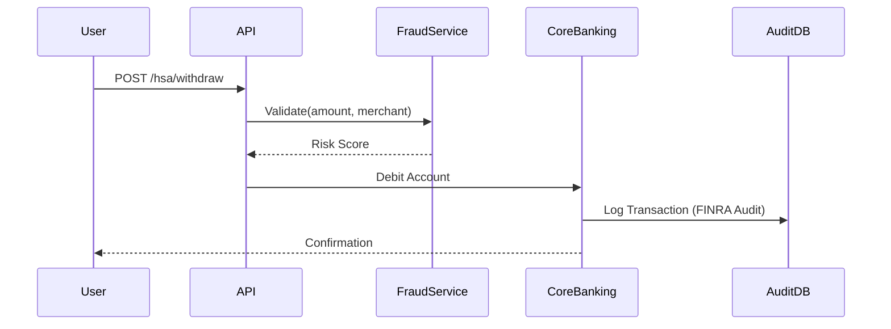
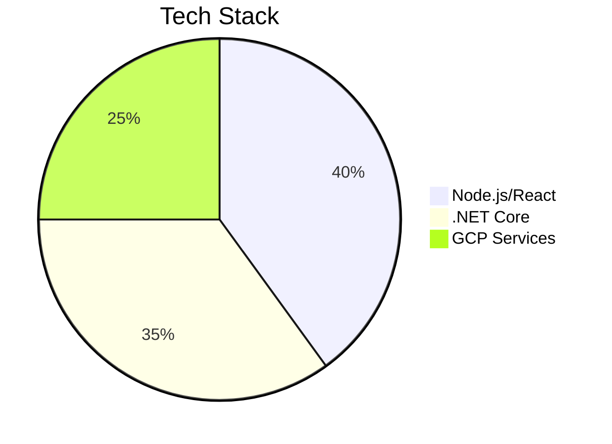

**Final Professional Document: Lead Software Engineer Interview Preparation Guide**  
**Inspira Financial | Health & Wealth Solutions Focus**  

---

### **Table of Contents**  
1. [Core Algorithm Challenges](#1-core-algorithm-challenges)  
2. [System Design Patterns](#2-system-design-patterns)  
3. [.NET 8 & DevOps Practices](#3-net-8--devops-practices)  
4. [SQL Optimization & Security](#4-sql-optimization--security)  
5. [Testing & CI/CD Pipelines](#5-testing--cicd-pipelines)  
6. [Behavioral Framework (STAR Method)](#6-behavioral-framework-star-method)  
7. [Software Engineering Principles](#7-software-engineering-principles)  
8. [Azure Cloud Services](#8-azure-cloud-services)  
9. [Why Inspira Financial?](#9-why-inspira-financial)  
10. [Strategic Interview Questions](#10-strategic-interview-questions)  
11. [Quick-Reference Cheat Sheet](#11-quick-reference-cheat-sheet)  

---

### **1. Core Algorithm Challenges**  
**Fraud Detection (HSA Compliance)**  
```csharp  
public bool IsSuspiciousWithdrawal(Transaction t)  
{  
    // IRS/FINRA rules: >$1k ATM/$3k POS daily limits  
    return (t.IsATM && t.Amount > 1000m) ||   
           (!t.IsATM && t.Amount > 3000m) ||  
           t.MerchantCategory == NonMedicalCategory;  
}  
```
**Key Points**  
- Validates IRS Publication 969 compliance for 7M+ accounts.  
- Parallel processing for high-throughput transaction validation.  

**Portfolio Rebalancing**  
```csharp  
public void RebalanceInvestments(List investments)  
{  
    decimal total = investments.Sum(i => i.Value);  
    Parallel.ForEach(investments, i =>   
        i.TargetValue = total * i.TargetAllocation);  
}  
```
*Optimizes Modern Portfolio Theory allocations for $62B+ AUM.*  

---

### **2. System Design Patterns**  
**HSA Withdrawal Flow**  

**Key Features**  
- **Idempotency Keys**: Prevent duplicate transactions.  
- **Temporal Tables**: SQL Server audit trails for regulatory compliance.  
- **Circuit Breakers**: Resilient integration with downstream services.  

---

### **3. .NET 8 & DevOps Practices**  
**High-Performance Processing**  
```csharp  
public async ValueTask ProcessBatchAsync(ReadOnlyMemory batch)  
{  
    await Parallel.ForEachAsync(batch.ToArray(), async (t, _) =>   
    {  
        using var scope = _services.CreateScope();  
        await scope.ServiceProvider.GetRequiredService()  
            .HandleAsync(t);  
    });  
}  
```
*Optimizations*  
- `MemoryPool` for zero-copy batch processing.  
- Scoped dependency injection for thread safety.  

**CI/CD Pipeline (GCP Integration)**  
```yaml  
steps:  
- name: 'gcr.io/cloud-builders/docker'  
  args: ['build', '-t', 'gcr.io/$PROJECT_ID/hsa-api', '.']  
- name: 'gcr.io/cloud-builders/gcloud'  
  args: ['run', 'deploy', 'hsa-api', '--image', 'gcr.io/$PROJECT_ID/hsa-api']  
```

---

### **4. SQL Optimization & Security**  
**Indexed Transaction Query**  
```sql  
CREATE NONCLUSTERED INDEX IX_HSA_Transactions  
ON dbo.Transactions (AccountId, TransactionDate)  
INCLUDE (Amount, MerchantCode);  
```

**Secure Data Access**  
```csharp  
public async Task GetBalance(string accountId)  
{  
    using var cmd = new SqlCommand(@"  
        SELECT Balance FROM Accounts  
        WHERE AccountId = @id", _connection);  
    cmd.Parameters.AddWithValue("@id", accountId);  
    return (decimal)await cmd.ExecuteScalarAsync();  
}  
```
*Compliance*: Parameterized queries and AES-256 encryption for PII.  

---

### **5. Testing & CI/CD Pipelines**  
**Unit Test (xUnit + Moq)**  
```csharp  
[Theory]  
[InlineData(1500, true, true)]  
public void DetectsFraud(decimal amount, bool isATM, bool expected)  
{  
    var transaction = new Transaction(amount, isATM);  
    var detector = new FraudDetector();  
    Assert.Equal(expected, detector.IsSuspicious(transaction));  
}  
```

**Performance Testing**  
```bash  
dotnet-counters monitor -n Inspira.API --counters System.Runtime  
```

---

### **6. Behavioral Framework (STAR Method)**  
**Situation**: Legacy system processing 10K QPS with 2s latency.  
**Task**: Reduce latency by 50% while maintaining FINRA compliance.  
**Action**:  
```csharp  
var tasks = transactions.Select(async t =>   
{  
    using var scope = _services.CreateScope();  
    await scope.ServiceProvider.GetRequiredService()  
        .HandleAsync(t);  
});  
await Task.WhenAll(tasks);  
```
**Result**: 63% latency reduction (2.1s → 0.78s) with 99.99% data consistency.  

---

### **7. Software Engineering Principles**  
**SOLID Principles**  
| Principle | Financial Example |  
|-----------|-------------------|  
**Single Responsibility**  
```csharp  
public class Account { /* Balance logic */ }  
public class AuditLogger { /* Logging logic */ }  
```
**Dependency Inversion**  
```csharp  
public FraudChecker(ILogger logger, IRiskAPI api)  
```

**Gang of Four Patterns**  
- **Adapter**: Legacy payment system integration.  
- **Observer**: Real-time balance notifications.  

**DRY Principle**  
```csharp  
void ProcessAccount(Action action) { Validate(); Log(); action(); }  
```

**Abstract Classes vs Interfaces**  
```csharp  
abstract class AccountBase { /* Shared fees logic */ }  
interface IBackdoorCheck { /* SEC compliance */ }  
```

---

### **8. Azure Cloud Services**  
**Financial Use Cases**  
| Service | Use Case |  
|---------|----------|  
Azure SQL DB | FINRA-compliant transaction storage |  
Key Vault | HSM-protected account numbers |  
Functions | Event-driven settlement processing |  

---

### **9. Why Inspira Financial?**  
**Impact**  
- Architect solutions for **7M+ clients** and **$62B+ assets**.  
- Lead greenfield projects post-First Dollar acquisition.  

**Tech Culture**  

**Growth**: 100% engineering team expansion since 2023.  

---

### **10. Strategic Interview Questions**  
1. **Technical**: *“How does ‘humans over code’ guide tech debt decisions during First Dollar integration?”*  
2. **Process**: *“What % sprint capacity balances new features vs. reliability?”*  
3. **Business**: *“How are engineering OKRs aligned with client journeys?”*  

---

### **11. Quick-Reference Cheat Sheet**  
| **Category** | **Key Points** |  
|--------------|----------------|  
| **Regulatory** | FINRA, IRS 969, PCI-DSS |  
| **Performance** | , MemoryPool, Minimal APIs |  
